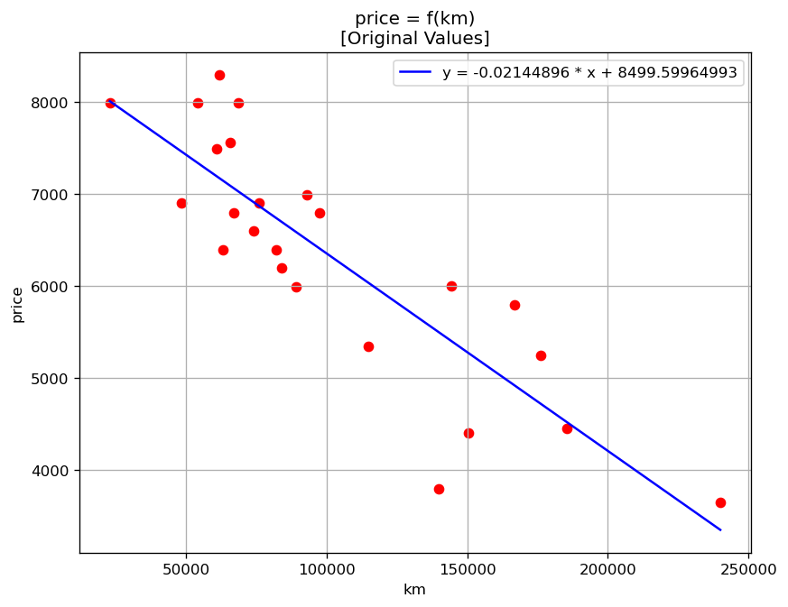
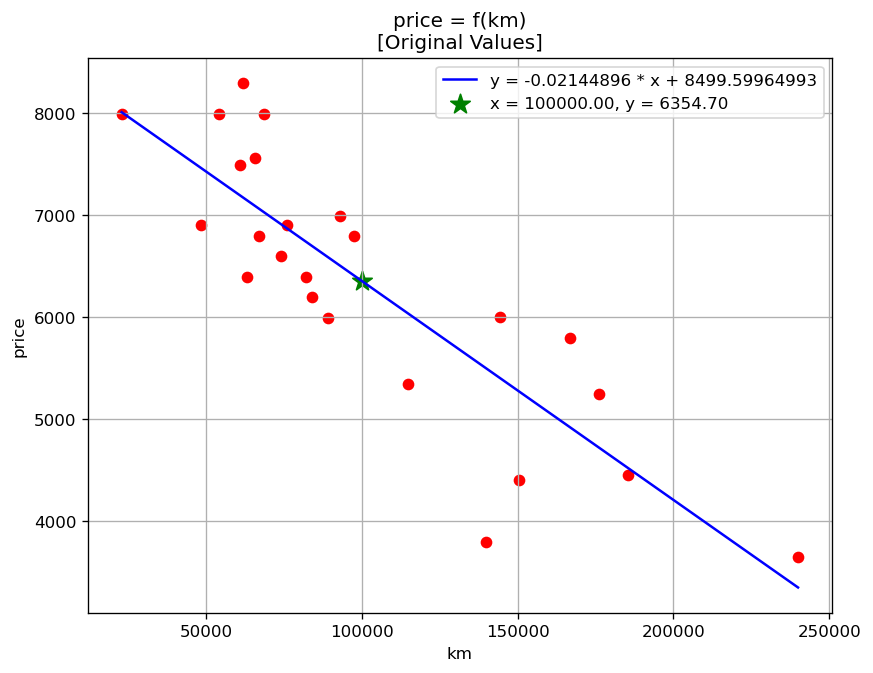

# ft_linear_regression

In this project, our first machine learning algorithm will be implemented. The goal is to write a programmatic simple linear regression using gradient descent to predict the price of a car based on its mileage.

## Description

**ft_linear_regression** is an introductory project to the fundamentals of machine learning at 42. By completing this project, the core concepts behind simple machine learning algorithms are understood: datasets, learning rates, epochs (iterations), gradient descent, model predictions, and data normalization.

The project requires the creation of two main programs:
1. **`trainer.py`**: Reads a dataset (e.g., `data.csv`), normalizes the data, applies gradient descent iteratively to calculate the optimal `theta0` (y-intercept) and `theta1` (slope), de-normalizes the results, and saves these weights to a file (e.g., `data.json`).
2. **`predictor.py`**: Interacts with the user, prompting them for a mileage (or another feature depending on the dataset provided). It uses the weights from `data.json` to calculate and output the estimated price (or corresponding feature).

## Usage

### 1. The Trainer (`trainer.py`)

The trainer calculates the linear regression algorithm.

```bash
python3 trainer.py [dataset_file.csv] [-p] [-n] [-r] [-a]
```

**Arguments:**
- `dataset_file.csv` (optional): The dataset to train with. Defaults to `data.csv`.
- `-p`: Plot the original dataset.
- `-n`: Plot the normalized dataset.
- `-r`: Plot the final linear regression.
- `-a`: Display model accuracy metrics.

### 2. The Predictor (`predictor.py`)

The predictor estimates a value based on the trained model.

```bash
python3 predictor.py [thetas_file.json] [-p]
```

**Arguments:**
- `thetas_file.json` (optional): The file generated by the trainer. Defaults to `data.json`.
- `-p`: Plot the estimated value over the linear regression line.

If `predictor.py` is executed before training, the program defaults `theta0` and `theta1` to `0`, making the prediction `0`.

## Datasets

The project uses `data.csv` as the main dataset, featuring columns: `km` and `price`.
Additional datasets (for testing) are available in the `datasets/` directory. Both scripts support parsing dynamic labels depending on the provided CSV files.

## Concepts

### Gradient Descent
Gradient descent is an iterative optimization algorithm used to find the minimum value of a **cost function**. A cost function captures the amount of "displeasure" a specific hypothesis causes us, i.e. how far off its predictions are from the actual values. For a linear regression, this cost function is the **Mean Squared Error (MSE)**:

```
cost(theta0, theta1) = (1 / m) * Σ (estimatePrice(mileage[i]) - price[i])²
```

where `estimatePrice(mileage) = theta0 + theta1 * mileage` is the hypothesis, and `m` is the number of data points in the dataset.

Gradient descent minimizes this cost by repeatedly nudging `theta0` and `theta1` in the direction that reduces the error the most (the negative gradient of the cost function), scaled by the `learning rate`:

```
tmp_theta0 = learning_rate * (1 / m) * Σ (estimatePrice(mileage[i]) - price[i])
tmp_theta1 = learning_rate * (1 / m) * Σ (estimatePrice(mileage[i]) - price[i]) * mileage[i]
```

Both `theta0` and `theta1` are then updated **simultaneously** from these temporary values, and the process repeats, getting `theta0` and `theta1` closer and closer to the values that minimize the cost function, until the change between iterations becomes negligible (convergence) or the algorithm times out.

### Normalization
The data needs to be normalized before applying the gradient descent given the gap between `km` magnitudes and `price` magnitudes. This prevents overflow issues and drastically improves the speed and convergence of the gradient descent.

### Learning Rate
The learning rate controls how big a step the gradient descent takes towards the minimum of the cost function on each iteration. A value too small makes the algorithm converge slowly (or hit the timeout before finishing), while a value too large can make it overshoot the minimum and fail to converge at all.

It is set through the `LEARNING_RATE` constant at the top of [`trainer.py`](trainer.py), defaulting to `0.005`. To experiment with it, simply edit that constant and re-run the trainer:
```python
LEARNING_RATE = 0.005
```

## Accuracy Metrics

When the trainer is executed with the `-a` flag, it calculates and displays several metrics to evaluate the performance of the generated linear regression model:

- **Correlation Coefficient (R)**: Measures the strength and direction of the linear relationship between the two variables (-1 to 1).
- **Coefficient of Determination (R²)**: Evaluates how well the regression line approximates the real data points (0 to 1). It indicates the proportion of the variance in the dependent variable that is predictable from the independent variable.
- **Root Mean Squared Error (RMSE)**: Calculates the standard deviation of the residuals (prediction errors), giving a measure of how spread out these errors are.
- **Mean Absolute Error (MAE)**: Measures the average magnitude of the errors in a set of predictions, without considering their direction.
- **Residual Standard Error (RSE)**: Similar to RMSE, but adjusted for the degrees of freedom (penalizes the number of parameters estimated).

## Error Handling

Both programs include comprehensive error handling to ensure smooth execution and provide clear feedback if something goes wrong.

### `trainer.py`
- **Dataset Format**: Raises an error if the CSV file lacks exactly two columns per row or contains less than two data points.
- **Data Integrity**: Checks for non-numeric values, identical points, or identical X-values (which make regression impossible, e.g., in a vertical dataset).
- **File Accessibility**: Catches missing files, corrupted files, or permission errors.
- **Timeout**: The gradient descent terminates and raises an error if it fails to converge within the 10-second timeout.
- **Arguments**: Detects and reports unrecognized command-line arguments.

### `predictor.py`
- **Model File**: Validates JSON formatting and ensures required keys (`theta0`, `theta1`, `labels`) are present.
- **Missing Model**: If the specified weights file (e.g., `data.json`) is not found, the program safely defaults both thetas to `0` instead of crashing.
- **User Input**: Rejects non-numeric inputs during the interactive prompt and gracefully exits upon user interrupt (`Ctrl+C` or `Ctrl+D`).
- **Arguments**: Detects and reports unrecognized command-line arguments.

## Requirements
- Python 3.10+
- The `matplotlib` library, used for plotting elements. It is required to run either program, even without the plot flags, since both import from `utils.py`, which loads `matplotlib.pyplot` at the top level.

### Setup
```bash
git clone https://github.com/jesuserr/42Cursus_ft_linear_regression
cd 42Cursus_ft_linear_regression

# Install matplotlib (optional, for plotting)
# Debian/Ubuntu (system packages):
sudo apt update
sudo apt install -y python3 python3-pip python3-matplotlib
```

## Example

```bash
$ python3 trainer.py -p -r -a      
Parsing data... OK
Calculating linear regression... OK     
iterations = 114,931
learning rate = 0.005
theta0 = 8,499.59965
theta1 = -0.02145
Exporting thetas to 'data.json'... OK
Calculating model metrics... OK
Correlation Coefficient (R) = -0.8561
Coefficient of Determination (R²) = 0.7330
Root Mean Squared Error (RMSE) = 667.5667
Mean Absolute Error (MAE) = 557.8384
Residual Standard Error (RSE) = 697.2506
```

The `-p -r` flags also generate the following plot, showing the dataset along with the calculated linear regression line:



```bash
$ python3 predictor.py -p
Reading thetas from 'data.json'... OK
theta0 = 8,499.59965
theta1 = -0.02145
Please enter car mileage: 100000
Estimated price for a car with a mileage of 100,000.00 km = 6,354.70 Euros
```

The `-p` flag also generates the following plot, showing the estimated value over the linear regression line:

